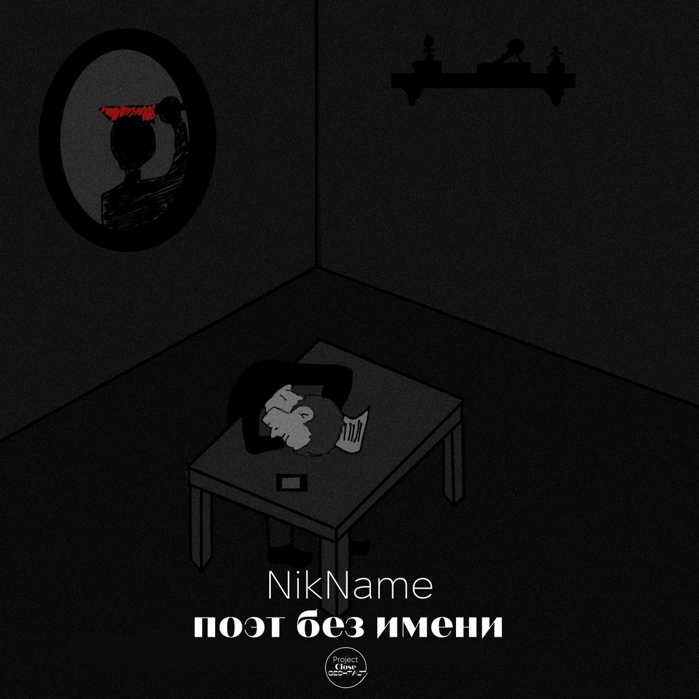
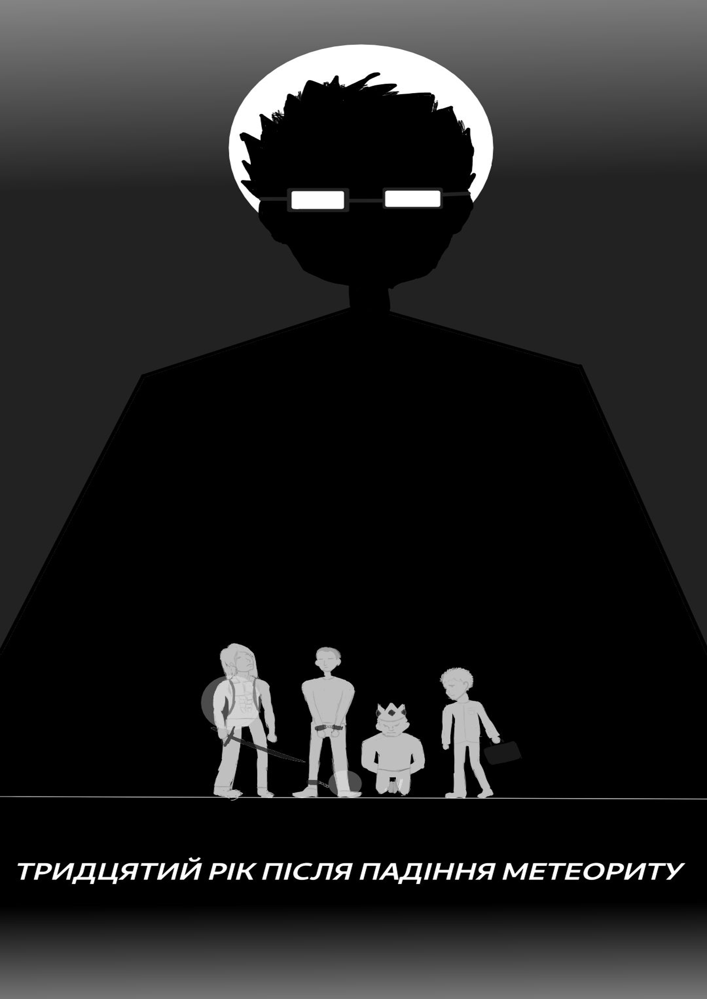
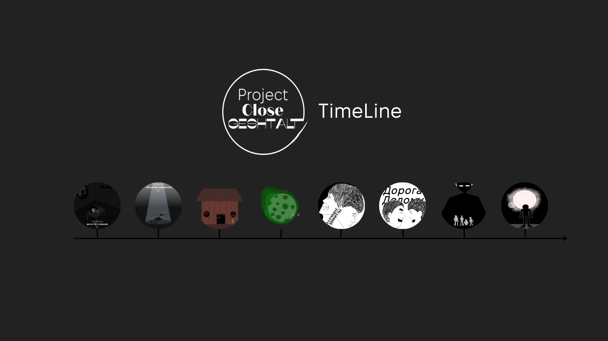

# Project Closed Geshtalt

Project Close Geshtalt has [Ukrainian :ukraine:](#project-closed-geshtalt-ua-ukraine) and [English :uk:](#project-closed-geshtalt-en-uk) localizations

# Project Closed Geshtalt :ukraine:

  

## Короткий опис

***Project Closed Geshtalt*** - це проект, в якому я реалізую по одному проекту в кожній з галузей, які я намагався вивчати в шкільні роки. Таким чином я закриваю гештальт і дізнаюся, чому я навчився за весь цей час.

## Мета

Мета проекту: зробити по одному закінченому проєкту в таких галузях як:

* Музика
* Розробка ігор
* Малювання коміксів
* Написання книг
* Розробка сайтів

## Гілки

У кожній галузі буде своя гілка, в якій я зберігатиму свій проект.

Також хочу зазначити, що проєкти розроблялися з 01.06.2023 по 04.02.2024. Тому вони були розбиті на два етапи:

Перший етап: з 01.06.2023 до 01.09.2023. На цьому етапі була створена основа проєкту, тобто всі проекти були створені, але вони не були відредаговані та дороблені.
    
Другий етап: з 01.10.2023 до 04.02.2024. На цьому етапі всі проекти були відредаговані та дороблені.

Тому репозиторій також розбитий на дві частини: гілка створеного до 01.09 та гілка створеного до 04.02.

* [**01.09**](01.09/) - гілка розроблена з 01.06 до 01.09

  * [**Гілка music**](01.09/Music) - це проект з написання музики.
  
  * [**Гілка visual novel**](01.09//Visual_Novel/) - це проект з розробки візуальної новели.
  
  * [**Гілка comics**](01.09/Comics/) - це проект з малювання коміксів.
  
  * [**Гілка book**](01.09/Book/) - це проект з написання книги.
  
  * [**Гілка site**](01.09/Site/) - це проект з розробки сайту.

* [**04.02**](04.02/) - гілка розроблена з 01.10 до 04.02

  * [**Гілка music**](04.02//Music) - це проект з написання музики.
  
  * [**Гілка visual novel**](04.02//Visual_Novel/) - це проект з розробки візуальної новели.
  
  * [**Гілка comics**](04.02/Comics/) - це проект з малювання коміксів.
  
  * [**Гілка book**](04.02/Book/) - це проект з написання книги.
  
  * [**Гілка site**](04.02/Site/) - це проект з розробки сайту.

## Про проєкти

### Музика

#### Поєт без имени

текст

  

#### Помилка вцілілого

текст

  

___

### Ігри

#### Останній відпочинок

Зануртеся в постапокаліптичний світ, де люди перетворюються на небезпечних гуманоїдів. У цій візуальній новелі ви граєте за Олексія, звичайного жителя міста Кіфі, який намагається вижити в цьому новому, жорстокому світі. Ви будете стикатися з небезпечними гуманоїдами, а також з іншими людьми, які можуть бути не менш небезпечними.

  

#### Під домом

Ви повертається до будинку, де виросли, щоб знайти відповіді на питання про своє минуле. Але підземелля, що ховаються під будинком, виявляються небезпечнішими, ніж ви могли собі уявити. Ви повинні боротися зі своїми дитячими страхами, щоб знайти вихід на гору. Але чим більше ви дізнаєтесь про свою сім'ю, тим більше ви починаєте сумніватися в тому, що хочете справді знайти.

  

___

### Комікси

#### Літера смерті. Останній вирок

Уявіть, що ви отримали гаджет, який змінює особистість. Але він пробуджує у вас серійного вбивцю. Саме це сталося з героєм коміксу "Літера смерті. Останній вирок". Він став бета-тестером гаджета Его, що змінює характер. Але несподівано у місті почалися жорстокі вбивства. І всі сліди ведуть до головного героя. Хто він насправді? Чи зможе він перебороти свою темну сторону? Пориньте у захоплюючий світ подвійної особистості та неочікуваних поворотів у коміксі "Літера смерті. Останній вирок".

  

#### Дорога додому

Уявіть, що ви мусите тікати з дому через катастрофу. А потім дізнаєтесь, що туди можна повернутися. Саме це трапляється з героями коміксу "Дорога додому". Колись друзі Ігор і Данило тікали з рідного селища через наслідки падіння метеорита. А тепер почули, що туди можна повернутися. Незважаючи на небезпеки, хлопці вирушають у рисковану подорож додому. Це стає випробуванням їхньої дружби та відваги. Чи дістануться вони до мети? І що чекатиме їх у зруйнованому селищі? Дізнайтеся у захопливому коміксі "Дорога додому"!

  

___

### Книги

#### 30 років після нашої ери

У світі постапокаліпсису вчений прокидається після тривалого сну. Він опиняється в пустелі, де колись було місто. Щоб дізнатися, що трапилось із людством, він вирушає на пошуки останнього поселення під куполом. Чи вдасться йому дістатися цього міста і знайти відповіді на питання про долю людства? Чи є ще надія врятувати світ від загибелі? Читайте захопливу пригодницьку розповідь про світ майбутнього, щоб дізнатися!

  

#### Проміжне покоління

У не далекому майбутньому група колоністів відправляється в міжгалактичну подорож на космічному кораблі "Арго", щоб знайти новий дім на планеті Едем. Але їх чекає довга і небезпечна мандрівка, яка триватиме століття. Кожне нове покоління на борту має вирішувати - чи варто продовжувати рух в невідомість, чи краще повернутися на Землю або колонізувати якусь ближчу планету. На їхніх плечах лежить відповідальність за долю усього людства. Чи дістануться вони до мети? Читайте захопливу пригодницьку історію про відвагу, дружбу та пошуки нового дому серед зірок!

  

## Таймлайн

Якщо ви вже почали ознайомлюватись із плодами моєї творчості, то могли помітити, що світ в усіх історіях дуже схожий. Це не моя безідейність, а продуманий задум. Всі історії відбуваються в одному і тому ж світі, тому я вирішив зробити схему для більшої наглядності, щоб люди могли ознайомитися з ними всіма в хронологічній послідовності.

  

1. ***Поет без імені*** (музика) - історії простої людини, яка пише вірші
2. ***Помилка вцілілого*** (музика) - історія тієї ж людини, але під час Українсько-російської війни 2022 року
3. ***Під домом*** (гра) - подорож одного чоловіка вглиб себе через зустріч з дитячими страхами, розкриваючи таємниці батьків.
4. ***Останній відпочинок*** (гра) - історія звичайного жителя міста Кіфі, що одного дня опиняється в самому серці апокаліпсису, що спричинив метеорит, що впав у центр міста. Метеорит виділяє зелений газ, що перетворює людей на мутантів, а головний герой намагається виїхати з території розповсюдження газу підбираючи декількох людей по дорозі до точки евакуації
5. ***Літера смерті. Останній вирок*** (комікс) - історія про звичайного, на перший погляд жителя міста Моргород, який є одним з бета тестерів нового гаджета. Годинника Его, який може змінювати зовнішність користувача, та трохи впливати на його психологічні характеристики. У цьому місті починаються серійні вбивства корумпованих чиновників, а згодом виявляється, що їх вчиняла друга особистість головного героя, яка виявляється справжнім головним героем, а той виявляється другою особистістю створеною годиником Его.
6. ***Крізь газ до порогу*** (комікс) - історія про друзів двох дитинства, які таємно пробираються до рідного селища, звільненого від мутантів, які там оселились після падіння метеориту на місто Кіфі.
7. ***30 рік після нашої ери*** (книга) - фантастична історія вченого, який намагається змінити майбутнє, відправляючи послання у минуле після апокаліпсису.
8. ***Проміжне покоління*** (книга) - історія про проміжне покоління між галактичної екпансії, які вимушені летіти на планету в іншій галактиці, бо так вирішили їх пращури, тож перед ними стає вибір чи довіритись цьому вибору, чи зробити свій.

## Посилання на завершені проєкти

* [Веб-сайт проекту](https://project-close-geshtalt.netlify.app/)
<!-- SoundCloud -->
<!-- Itch.io -->
<!-- Honey Manga -->
<!-- Літота -->

___

# Project Closed Geshtalt :uk:

  

## Brief description

The Closed Gestalt Project is a project in which I am implementing one project in each of the fields that I tried to study in my school years. In this way, I am closing the gestalt and finding out what I have learned during all this time.

## Goal

The goal of the project is to make one completed project in the following fields:

* Music
* Game development
* Drawing comics
* Writing books
* Website development

## Branches

Each branch will have its own branch where I will keep my project.

I also want to note that the projects were developed from 01.06.2023 to 04.02.2024. Therefore, they were divided into two stages:

First stage: from June 01, 2023 to September 01, 2023. At this stage, the basis of the project was created, i.e. all projects were created, but they were not edited and finalized.
    
Second stage: from 01.10.2023 to 04.02.2024. At this stage, all projects were edited and finalized.

Therefore, the repository is also divided into two parts: the branch of projects created before 01.09 and the branch of projects created before 04.02.

* [**01.09**](01.09/) - branch developed from 01.06 to 01.09

  * [**Music branch**](01.09/Music) is a music writing project.
  
  * [**Visual Novel Branch**](01.09//Visual_Novel/) is a project for developing a visual novel.
  
  * [**Comics branch**](01.09/Comics/) is a comic book project.
  
  * [**Branch book**](01.09/Book/) is a book writing project.
  
  * [**Site branch**](01.09/Site/) is a website development project.

* [**04.02**](04.02/) - a branch developed from 01.10 to 04.02

  * [**Music branch**](04.02//Music) is a music writing project.
  
  * [**Visual novel branch**](04.02//Visual_Novel/) is a project for developing a visual novel.
  
  * [**Comics branch**](04.02/Comics/) is a comic book project.
  
  * [**Branch book**](04.02/Book/) is a book writing project.
  
  * [**Site branch**](04.02/Site/) is a website development project.

## About projects

### Music

#### Poet without a name

lyrics

  

#### Survivor's Error

text.

  

___

### Games

#### The Last Rest

Immerse yourself in a post-apocalyptic world where people are turning into dangerous humanoids. In this visual novel, you play as Alexei, an ordinary resident of the city of Kifi, who is trying to survive in this new, cruel world. You will encounter dangerous humanoids, as well as other people who can be just as dangerous.

  

#### Under the house

You return to the house where you grew up to find answers to questions about your past. But the dungeons that lie beneath the house are more dangerous than you could have ever imagined. You have to fight your childhood fears to find your way to the top. But the more you learn about your family, the more you begin to question what you really want to find.

  

___

### Comics

#### The Letter of Death. The last sentence

Imagine you've received a gadget that changes your personality. But it awakens a serial killer in you. This is exactly what happened to the hero of the comic book "The Letter of Death. The Last Sentence". He became a beta tester of the character-changing gadget Ego. But suddenly, brutal murders began in the city. And all the traces lead to the main character. Who is he really? Will he be able to overcome his dark side? Immerse yourself in the fascinating world of dual personalities and unexpected twists and turns in the comic book The Letter of Death. The Last Sentence".

  

#### The Road Home

Imagine you have to flee your home because of a disaster. And then you find out that you can return there. This is exactly what happens to the characters of the comic book The Road Home. Once upon a time, friends Ihor and Danylo fled their home village because of the effects of a meteorite. Now they hear that they can return there. Despite the dangers, the boys embark on a risky journey home. It becomes a test of their friendship and courage. Will they reach their goal? And what awaits them in the destroyed village? Find out in the exciting comic book The Road Home!

  

___

### Books

#### 30 years after our era

In a post-apocalyptic world, a scientist wakes up after a long sleep. He finds himself in the desert where a city used to be. To find out what happened to humanity, he sets out to find the last settlement under the dome. Will he manage to reach this city and find answers to the questions about the fate of humanity? Is there still hope to save the world from destruction? Read the exciting adventure story about the world of the future to find out!

  

#### The Intermediate Generation

In the not-too-distant future, a group of colonists embarks on an intergalactic journey on the spaceship Argo to find a new home on the planet Eden. But they face a long and dangerous journey that will last for centuries. Each new generation on board has to decide whether to continue moving into the unknown, or whether it is better to return to Earth or colonize a nearby planet. They are responsible for the fate of all humanity. Will they reach their goal? Read an exciting adventure story about courage, friendship, and the search for a new home among the stars!

  

___

## Timeline

If you have already started to familiarize yourself with the fruits of my creativity, you may have noticed that the world in all the stories is very similar. This is not my lack of ideas, but a well-thought-out plan. All the stories take place in the same world, so I decided to make a diagram for greater clarity so that people could read them all in chronological order.

  

1. ***The Poet with No Name*** (music) - stories of an ordinary person who writes poetry
2. ***Survivor's Mistake*** (music) - the story of the same person, but during the Ukrainian-Russian war of 2022
3. Under the House*** (play) - a man's journey deep into himself through facing his childhood fears and revealing the secrets of his parents.
4. ***The Last Rest*** (game) - the story of an ordinary resident of the city of Kifi, who one day finds himself in the heart of an apocalypse caused by a meteorite that crashes into the city center. The meteorite releases green gas that turns people into mutants, and the protagonist tries to leave the area of the gas spreading, picking up several people on the way to the evacuation point.
5. ***Letter of Death. The Last Sentence*** (comic book) is a story about an ordinary, at first glance, resident of the city of Morgorod, who is one of the beta testers of a new gadget. An ego watch that can change the user's appearance and slightly affect their psychological characteristics. In this city, serial murders of corrupt officials begin, and later it turns out that they were committed by the second personality of the protagonist, who turns out to be the real protagonist, and he turns out to be the second personality created by the Ego watch.
6. ***Through the Gas to the Threshold*** (comic book) - a story about two childhood friends who secretly make their way to their native village, liberated from mutants who settled there after a meteorite fell on the city of Kifi.
7. ***30 years after our era*** (book) - a fantastic story of a scientist who tries to change the future by sending messages to the past after the apocalypse.
8. ***The Intermediate Generation*** (book) - a story about the intermediate generation between galactic expansion, who are forced to fly to a planet in another galaxy because their ancestors decided so, so they have a choice: either to trust this choice or to make their own.

## References.

* [Project website](https://project-close-geshtalt.netlify.app/)
<!-- SoundCloud -->
<!-- Itch.io -->
<!-- Honey Manga -->
<!-- Літота -->
